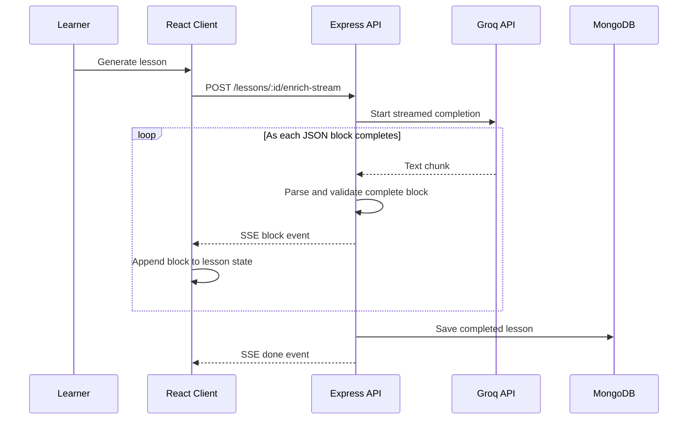
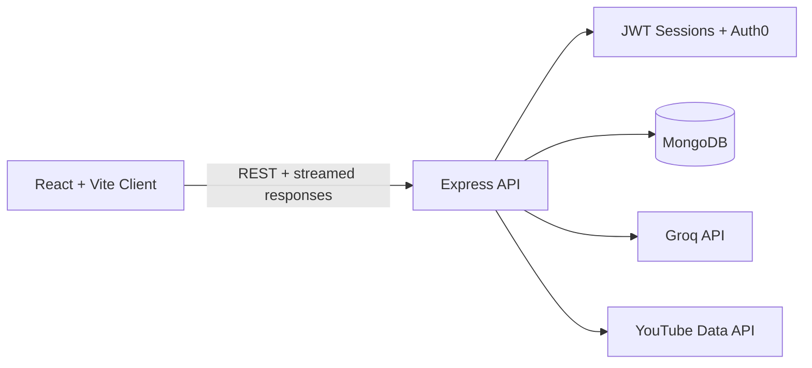

<div align="center">

# CourseAI (LIVE DEMO EXPLANATION:- https://youtu.be/PB9uZic8KMg)

### Turn a learning goal into a complete, interactive course.

CourseAI generates structured course outlines, streams rich lessons as they are created, and gives every lesson its own tutor, quiz, flashcards, practice lab, notes, videos, and progress tracking.

[](https://react.dev/)
[](https://expressjs.com/)
[](https://www.mongodb.com/)
[](https://groq.com/)
[](https://auth0.com/)

[Product](#product-tour) &middot; [Streaming](#engineering-highlight-ai-lesson-streaming) &middot; [Architecture](#architecture) &middot; [API](#api-snapshot) &middot; [Run Locally](#local-development)

</div>

---

## Why CourseAI?

Most AI learning tools stop after returning a wall of generated text. CourseAI treats generated content as a real learning experience:

- **Structured generation:** AI output is validated and converted into headings, paragraphs, code snippets, lists, and callouts.
- **Block-level streaming:** complete lesson blocks appear in the UI while the model is still generating the rest.
- **Active learning:** every lesson can produce quizzes, flashcards, practice labs, tutor answers, and relevant videos.
- **Persistent progress:** bookmarks, private notes, quiz analytics, recent activity, completion state, and certificates survive across sessions.
- **Privacy-aware sharing:** public course links expose learning content while excluding private notes and progress data.

## Product Tour

video explanation:- https://youtu.be/PB9uZic8KMg

| Stage | Experience |
| --- | --- |
| **Create** | Describe a topic and receive a structured course containing modules and lessons. |
| **Learn** | Generate lessons at brief, standard, or deep detail levels in a chosen language. |
| **Explore** | Ask the lesson tutor questions, add YouTube videos, and save private notes. |
| **Practice** | Generate flashcards, five-question quizzes, and practical mini-projects on demand. |
| **Progress** | Resume recent lessons, track completion, bookmark content, and review quiz performance. |
| **Complete** | Unlock and print a personalized certificate after finishing every lesson. |
| **Share** | Publish a read-only course link without exposing personal learning data. |

## Engineering Highlight: AI Lesson Streaming

CourseAI does not wait for the model to finish an entire lesson before showing content. It streams **semantic lesson blocks** from the AI provider to the browser.



The model is prompted to return a structured `contentBlocks` array. The backend consumes the provider stream as an async iterator, tracks JSON braces and string boundaries, extracts each complete object, validates it, and forwards it immediately as a Server-Sent Event.

This gives the responsiveness of token streaming while keeping the frontend renderer predictable and type-aware.

Key implementation files:

- [`backend/services/groqService.js`](backend/services/groqService.js) handles provider-specific streaming and errors.
- [`backend/services/lessonGeneration.js`](backend/services/lessonGeneration.js) incrementally parses and validates structured blocks.
- [`backend/controllers/courseAiController.js`](backend/controllers/courseAiController.js) sends `block`, `done`, and `error` events.
- [`frontend/src/pages/LessonViewerPage.jsx`](frontend/src/pages/LessonViewerPage.jsx) reads and decodes the response stream.
- [`frontend/src/components/lesson/LessonRenderer.jsx`](frontend/src/components/lesson/LessonRenderer.jsx) renders each semantic block.

## Architecture



The codebase separates HTTP concerns, domain logic, provider integrations, and persistence:

```text
AI-coursegenerator/
|-- frontend/
|   |-- src/components/       Reusable UI and lesson tools
|   |-- src/pages/            Route-level screens
|   |-- src/hooks/            Authentication state
|   `-- src/utils/            API client and progress calculations
|-- backend/
|   |-- controllers/          Request validation and responses
|   |-- middlewares/          Sessions, Auth0 verification, errors
|   |-- models/               Mongoose data models
|   |-- routes/               Public and protected API routes
|   `-- services/             AI, persistence, access, and video logic
|-- ARCHITECTURE.md
`-- README.md
```

See [ARCHITECTURE.md](ARCHITECTURE.md) for additional implementation notes.

## Technology Stack

| Layer | Technologies |
| --- | --- |
| **Frontend** | React 18, React Router, Vite, Tailwind CSS, Axios, React Markdown, Lucide |
| **Backend** | Node.js, Express 5, Mongoose |
| **Database** | MongoDB |
| **AI** | Groq SDK with structured and streamed completions |
| **Authentication** | Local email/password, bcrypt, Auth0, JWT, HTTP-only cookies |
| **External API** | YouTube Data API |

## Security And Data Design

- Protected course routes require a valid HTTP-only session cookie.
- Auth0 access tokens are verified on the backend before creating an app session.
- Every private course and lesson operation checks resource ownership.
- Passwords are hashed with bcrypt before persistence.
- Request values are normalized, length-limited, and validated before use.
- Public sharing uses a random share ID and a separate read-only projection.
- Shared courses exclude private notes, bookmarks, activity, quiz results, and completion state.
- Provider and database secrets stay in backend environment variables.

## API Snapshot

| Method | Endpoint | Purpose |
| --- | --- | --- |
| `POST` | `/api/auth/register` | Create a local account and session |
| `POST` | `/api/auth/login` | Start a local session |
| `POST` | `/api/auth/auth0-sync` | Verify Auth0 identity and start an app session |
| `POST` | `/api/courses/generate` | Generate and persist a course outline |
| `GET` | `/api/courses/mine` | Load the authenticated learner's courses |
| `POST` | `/api/courses/lessons/:id/enrich-stream` | Stream a generated lesson |
| `PATCH` | `/api/courses/lessons/:id/progress` | Save notes, bookmarks, activity, or completion |
| `POST` | `/api/courses/lessons/:id/generate-quiz` | Generate a lesson quiz |
| `POST` | `/api/courses/lessons/:id/flashcards` | Generate a flashcard deck |
| `POST` | `/api/courses/lessons/:id/practice-lab` | Generate an applied mini-project |
| `POST` | `/api/courses/lessons/:id/chat` | Ask the lesson-aware AI tutor |
| `GET` | `/api/public/courses/:shareId` | Read a privacy-safe shared course |


## Design Decisions

- **SSE-style streaming over WebSockets:** lesson generation only needs one-way server-to-client updates, so a streamed HTTP response keeps the protocol focused.
- **`fetch` for lesson streaming, Axios elsewhere:** Fetch exposes the browser `ReadableStream` API directly, while Axios remains convenient for normal JSON requests.
- **Structured blocks over raw Markdown:** block types make lessons consistently renderable, independently validatable, and easy to extend.
- **Generate study tools on demand:** flashcards and labs do not inflate lesson documents when learners never request them.
- **Separate public projection:** privacy is enforced by the backend response shape instead of relying on the frontend to hide fields.
- **Final persistence after streaming:** users see incremental progress, while the database stores only the completed lesson as the canonical version.


<div align="center">

Built as a full-stack exploration of structured AI generation, streaming UX, secure persistence, and active learning.

</div>
