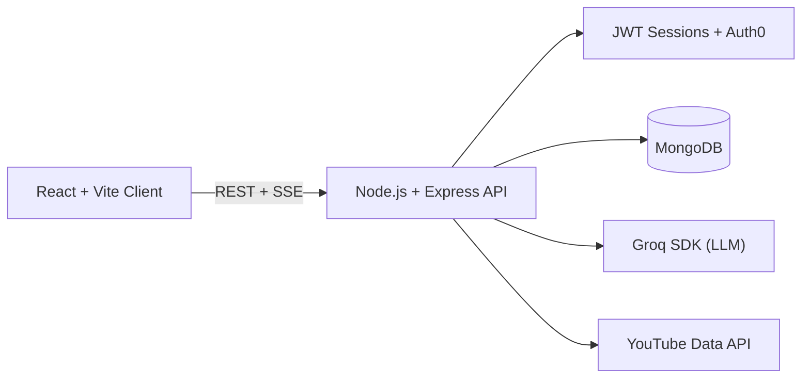
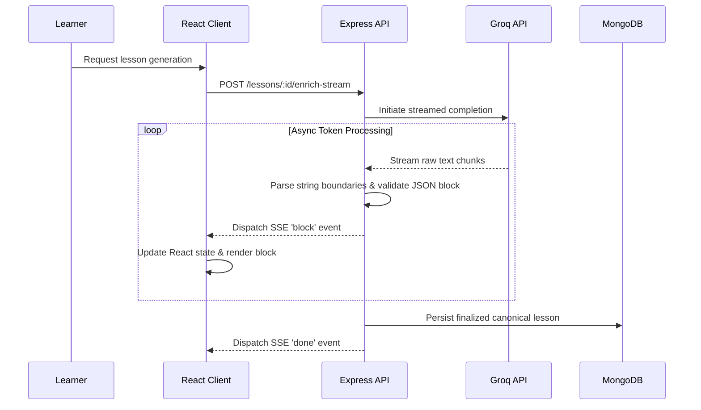

<div align="center">

# 🎓 CourseAI

**Turn a learning goal into a complete, interactive course.**

CourseAI is a full-stack AI learning platform that generates structured course outlines, streams rich lessons in real-time, and equips every lesson with dynamic study tools including a context-aware tutor, quizzes, flashcards, practice labs, and progress tracking.

[](https://react.dev/)
[](https://expressjs.com/)
[](https://www.mongodb.com/)
[](https://groq.com/)
[](https://auth0.com/)

[Product Tour](#product-tour) &middot; [System Architecture](#system-architecture) &middot; [Design Decisions](#design-decisions--trade-offs) &middot; [API](#api-snapshot) &middot; [Local Development](#local-development)

<br/>

### 🎥 Watch the Full Demo & Technical Breakdown
[](https://youtu.be/PB9uZic8KMg)
*(Click the image above to watch the video)*

</div>

---

## 🚀 Why CourseAI?

Most AI learning tools stop after returning a wall of generated text. CourseAI was engineered to treat generated content as a comprehensive, persistent, and interactive learning experience. 

* **Structured Generation:** AI output is strictly validated and converted into deterministic UI components (headings, paragraphs, code snippets, lists, and callouts) rather than raw, fragile Markdown.
* **Block-Level Streaming:** Complete lesson blocks dynamically render in the UI while the model continues generating subsequent content behind the scenes, eliminating loading friction.
* **Active Learning Engine:** Every generated lesson automatically supports on-demand quizzes, flashcards, practical mini-projects, context-aware AI tutoring, and supplementary YouTube video fetching.
* **Persistent Progress:** User progress is mapped across sessions, including bookmarks, encrypted private notes, quiz analytics, completion state, and personalized certificates.
* **Privacy-Aware Sharing:** Public course links utilize database-level projections to securely expose learning material while strictly omitting private notes and user progress data.

---

## 💻 Product Tour

| Stage | Experience |
| :--- | :--- |
| **Create** | Describe any topic and receive a highly structured course containing intelligent modules and lessons. |
| **Learn** | Generate lesson content at brief, standard, or deep detail levels in your chosen programming/spoken language. |
| **Explore** | Query the lesson-specific tutor, append relevant YouTube videos, and record private markdown notes. |
| **Practice** | Generate dynamic flashcards, 5-question multiple-choice quizzes, and applied practice labs on demand. |
| **Progress** | Resume recent modules, track completion percentages, bookmark critical concepts, and review analytics. |
| **Complete** | Unlock, generate, and print a personalized certificate upon 100% course completion. |
| **Share** | Publish a read-only, privacy-safe course link for external users. |

---

## 🏗️ System Architecture

The codebase enforces a strict separation of concerns across HTTP transport, domain logic, external AI provider integrations, and persistence. 



### Engineering Highlight: AI Lesson Streaming

CourseAI mitigates high latency by streaming **semantic lesson blocks** directly from the AI provider to the browser via Server-Sent Events (SSE), completely bypassing the need to wait for full document generation.



The LLM is prompted to return a structured `contentBlocks` JSON array. The Node.js backend consumes the provider stream as an async iterator, tracks JSON syntax boundaries in real-time, extracts each complete object, validates its schema, and flushes it immediately to the client. This delivers the exact responsiveness of raw token streaming while keeping the frontend renderer entirely predictable and type-safe.

---

## 🛠️ Technology Stack

| Layer | Technologies Used |
| :--- | :--- |
| **Frontend** | React 18, React Router v6, Vite, Tailwind CSS, Axios, React Markdown, Lucide Icons |
| **Backend** | Node.js, Express.js 5, Mongoose |
| **Database** | MongoDB (NoSQL Document Store) |
| **AI Integration** | Groq SDK (Utilizing structured JSON mode & streamed completions) |
| **Authentication**| Hybrid: Local Auth (bcrypt/email) + Auth0 Identity Verification, JWT, HTTP-only cookies |
| **External APIs** | YouTube Data API v3 |

---

## 🔐 Security & Data Integrity

* **Secure Sessions:** Protected routes mandate a valid, HTTP-only, `SameSite=strict` session cookie to prevent XSS and CSRF.
* **Identity Verification:** Auth0 access tokens are strictly verified server-side before an internal application session is established.
* **Resource Authorization:** Every private course/lesson route utilizes middleware to actively check database-level resource ownership against the requesting user's decoded JWT.
* **Data Sanitization:** All incoming request payloads are normalized, length-limited, and securely validated before interacting with the database.
* **Secret Management:** External API keys and database URIs are isolated securely within server-side environment variables and never exposed to the client bundle.

---

## 🧠 Design Decisions & Trade-offs

**(Key discussion points for technical reviews)**

* **SSE over WebSockets:** Lesson generation fundamentally requires unidirectional server-to-client updates. Implementing a streamed HTTP response via Server-Sent Events (SSE) keeps the protocol lightweight and focused, avoiding the unnecessary overhead, heartbeat tracking, and infrastructure complexity of maintaining bi-directional WebSocket connections.
* **Native `fetch` vs Axios:** While Axios is utilized globally for standard JSON REST queries, the native `fetch` API is explicitly used for the lesson streaming endpoint. This is because `fetch` directly exposes the browser's native `ReadableStream` API, allowing for highly efficient, low-level chunk processing.
* **Structured JSON Blocks over Raw Markdown:** Parsing AI data into specific block types (e.g., `type: 'code'`, `type: 'explanation'`) guarantees that lessons are consistently renderable and independently validatable. This avoids the inherent fragility of parsing raw LLM-generated Markdown, which frequently breaks UI layouts.
* **On-Demand Study Tools:** Heavy computational features like flashcards and practical labs are decoupled from the initial generation and triggered strictly on demand. This prevents database bloat, saves significant API token costs, and optimizes the initial lesson payload size.
* **Projection-Based Privacy:** Learner privacy is enforced at the database level via Data Transfer Objects (DTOs) and Mongoose projections. This completely strips sensitive fields (private notes, quiz scores) before data ever reaches the network layer, entirely removing the security burden from the frontend client.

---

## 📡 Core API Snapshot

| Method | Endpoint | Description |
| :--- | :--- | :--- |
| `POST` | `/api/auth/register` | Initialize local account and securely establish session |
| `POST` | `/api/auth/auth0-sync` | Validate Auth0 identity and map to internal user model |
| `POST` | `/api/courses/generate` | Generate and persist base course taxonomy |
| `POST` | `/api/courses/lessons/:id/enrich-stream` | **[Stream]** Generate lesson blocks via SSE |
| `PATCH`| `/api/courses/lessons/:id/progress` | Sync encrypted notes, bookmarks, or completion state |
| `POST` | `/api/courses/lessons/:id/practice-lab` | Generate an applied, context-aware coding mini-project |
| `POST` | `/api/courses/lessons/:id/chat` | Interface with the lesson-specific AI tutor |
| `GET`  | `/api/public/courses/:shareId` | Fetch a sanitized, read-only projection for public sharing |

---

## 💻 Local Development

To spin up this project locally, ensure you have **Node.js** and a running **MongoDB** instance (or MongoDB Atlas URI).

1. **Clone the repository:**
```bash
   git clone [https://github.com/yourusername/AI-coursegenerator.git](https://github.com/yourusername/AI-coursegenerator.git)
   cd AI-coursegenerator
   ```

2. **Install dependencies:**
```bash
   # Install backend dependencies
   cd backend
   npm install

   # Install frontend dependencies
   cd ../frontend
   npm install
   ```

3. **Configure Environment Variables:**
   * Create a `.env` file in the `/backend` directory matching `.env.example` (Requires: `MONGO_URI`, `GROQ_API_KEY`, `JWT_SECRET`, `YOUTUBE_API_KEY`).
   * Create a `.env` file in the `/frontend` directory matching `.env.example` (Requires Auth0 configuration).

4. **Boot the Application:**
```bash
   # Terminal 1: Boot backend server
   cd backend
   npm run dev

   # Terminal 2: Boot Vite client
   cd frontend
   npm run dev
   ```

<br/>

<div align="center">

*Engineered as a full-stack masterclass in structured LLM generation, real-time UX, and robust system architecture.*

</div>
